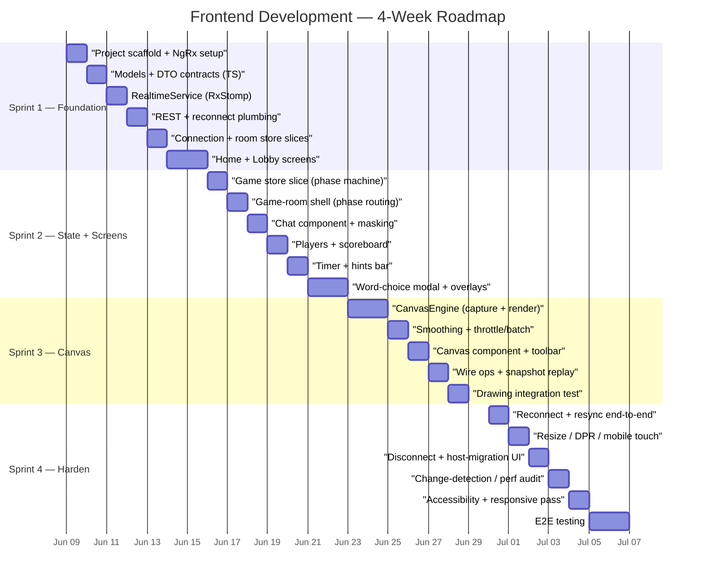
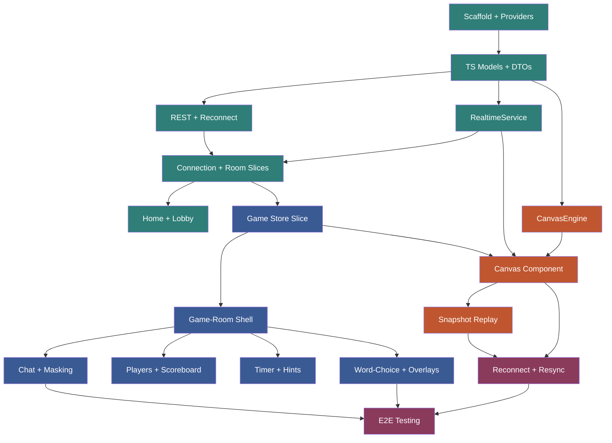

# Doodle Dash — Frontend Sprint Plan & Low-Level Design

> **Timeline:** 4 weeks (4 one-week sprints)
> **Stack:** Angular 17+ (standalone components), NgRx (store + effects), `@stomp/rx-stomp` for WebSocket/STOMP, custom `CanvasEngine` for drawing (no `signature_pad`)
> **Reference:** [High-Level Design](./doodle_design.md) · [Backend Sprint Plan](./backend-sprint-plan.md)
> **Scope:** This document covers **frontend only**. It assumes the backend STOMP/REST contract defined in the backend plan.

---

## Timing Assumption

The frontend develops **in parallel** with the backend, against the frozen DTO contracts (backend Sprint 1 DoD) plus a local mock STOMP broker. Real backend integration lands during frontend Sprint 4, which is deliberately scheduled to overlap with the backend's code-complete date (Jun 30).

| Date | Event |
|---|---|
| Jun 6 (Fri) | Backend DTO contracts frozen — frontend can begin |
| Jun 9 (Mon) | **Frontend Sprint 1 start** |
| Jul 4 (Fri) | **Frontend code-complete** |

If the team prefers a strictly sequential schedule (frontend starts after backend code-complete), shift every date below by ~4 weeks; the sprint *contents* are unchanged.

---

## Project Timeline Overview



---

## Architecture Recap

Five layers; the server is the single source of truth. The frontend renders state and captures input.

1. **Transport** — `RealtimeService` (one STOMP connection) + `LobbyApiService` (REST).
2. **State** — NgRx store: `connection`, `room`, `game`, `chat` feature slices. Server `RoomStateEvent`s are bridged into actions by effects.
3. **Presentational components** — read selectors, render.
4. **Routed screens** — `/` (home) and `/room/:id`. Lobby-vs-in-game is **conditional rendering** inside the room shell, not a route change (changing route would tear down the WebSocket).
5. **Backend** — authoritative game engine (out of scope here).

**The one deliberate exception:** draw events do **not** flow through NgRx. The `/topic/room/{id}/draw` channel is the highest-volume traffic in the app; routing it through the store would trigger change detection on every stroke segment. The `CanvasComponent` subscribes to `RealtimeService.draw$` directly and paints to the 2D context. The store only supplies *which mode the canvas is in* (`selectIsDrawer`, `selectGamePhase`).

---

## Package Structure

```
src/app/
├── core/
│   ├── realtime/
│   │   ├── realtime.service.ts        ← RxStomp wrapper: connect, subscribe, send
│   │   └── stomp.config.ts
│   ├── api/
│   │   └── lobby-api.service.ts        ← REST: create / find / check room
│   └── reconnect/
│       └── reconnect.service.ts        ← reconnect token (sessionStorage)
├── store/
│   ├── connection/                     ← actions · reducer · selectors · effects
│   ├── room/                           ← lobby slice (players, settings, host)
│   ├── game/                           ← phase machine, drawer, blanks, scoreboard
│   └── chat/                           ← message log
├── models/
│   ├── enums.ts                        ← GamePhase, GuessResultType, ...
│   ├── dto-inbound.ts                  ← client → server payloads
│   ├── dto-outbound.ts                 ← server → client payloads
│   ├── room-state-event.ts             ← discriminated union
│   └── draw-op.ts                      ← DrawOp (wire) + Stroke/NormPoint (model)
├── canvas/
│   ├── canvas-engine.ts                ← framework-agnostic: capture/render/serialize
│   ├── smoothing.ts                    ← quadratic-midpoint segment drawing
│   └── canvas.component.ts             ← Angular wrapper, mode toggle, brush state
├── features/
│   ├── home/home.component.ts
│   ├── lobby/lobby.component.ts
│   └── game-room/
│       ├── game-room.component.ts      ← shell, conditional by phase
│       ├── chat/chat.component.ts
│       ├── players/players.component.ts
│       ├── timer-hints/timer-hints.component.ts
│       ├── word-choice/word-choice.component.ts
│       ├── toolbar/toolbar.component.ts
│       └── results/results.component.ts
├── app.routes.ts
└── app.config.ts                       ← provideStore, provideEffects, provideRouter
```

---

## Backend Contract Dependencies

Three items must be agreed with the backend team **before they freeze DTOs**. Each came out of the design discussion and is cheap on the backend side but breaks the frontend if missed.

| # | Need | Why | Backend change |
|---|---|---|---|
| 1 | `strokeId` on `DrawMessageIn` / `DrawEventOut` | Streamed mid-stroke batches must be reassembled into strokes by the receiver. | Add one field. |
| 2 | `undo` removes all events sharing the last `strokeId` | Current `undoLast` removes one *batch*, not one *stroke*. Wrong under streaming. | One-line change in `DrawingService.undoLast`. |
| 3 | Coordinates are normalized `0..1`, not pixels | Drawer and guesser canvases differ in size/DPR; raw pixels misalign. | None — still two doubles; agreement only. |
| 4 | Discriminate `DrawingState` vs `HintUpdate` | Both ride the `DRAWING` state on `/state`; the union key `state` alone can't tell them apart. | Add an explicit `eventType` tag, **or** frontend treats a `DRAWING` event carrying only `currentBlanks` as a hint patch. |

Items 1–2 are the streaming-granularity decision (see Sprint 3). Items 3–4 are contract clarifications, not feature changes.

---

## Sprint 1 — Foundation, Transport & Lobby

**Dates:** Week 1 (Jun 9 – Jun 13)
**Sprint Goal:** A player can open the app, create or join a room over a live STOMP connection, land in a lobby, and see other players arrive and leave — the full lobby lifecycle, end-to-end against a mock or real backend.

### Capacity & Load

| Item | Estimate | Priority | Dependencies |
|---|---|---|---|
| Project scaffold + NgRx/router providers | 0.5d | P0 | None |
| TS models + DTO contracts + state-event union | 0.5d | P0 | Backend contract |
| RealtimeService (RxStomp connect/subscribe/send) | 1.0d | P0 | Scaffold |
| REST service + reconnect-token plumbing | 0.5d | P0 | RealtimeService |
| Connection + room store slices (actions/reducer/effects/selectors) | 1.0d | P0 | Models, Realtime |
| Home + Lobby screens | 1.5d | P0 | Store, services |
| **Total** | **5d** | | |

### Task 1.1 — Scaffold & Providers

Angular 17+ standalone bootstrap. No NgModules.

```typescript
// app.config.ts
export const appConfig: ApplicationConfig = {
  providers: [
    provideRouter(routes),
    provideStore({
      connection: connectionReducer,
      room: roomReducer,
      game: gameReducer,
      chat: chatReducer,
    }),
    provideEffects([ConnectionEffects, RoomEffects, GameEffects, ChatEffects]),
    provideHttpClient(),
    ...(isDevMode() ? [provideStoreDevtools()] : []),
  ],
};
```

```typescript
// app.routes.ts
export const routes: Routes = [
  { path: '', component: HomeComponent },
  { path: 'room/:id', component: GameRoomComponent },
  { path: '**', redirectTo: '' },
];
```

### Task 1.2 — Models & DTO Contracts

Mirror the backend records as TS interfaces. The key piece is the discriminated union for the polymorphic `RoomStateEvent.payload`.

```typescript
// enums.ts
export type GamePhase =
  | 'LOBBY' | 'WORD_SELECTION' | 'DRAWING'
  | 'TURN_END' | 'ROUND_END' | 'GAME_OVER';

// room-state-event.ts — discriminated on `state`
export type RoomStateEvent =
  | { state: 'LOBBY';          payload: LobbyState }
  | { state: 'WORD_SELECTION'; payload: WordSelectionState }
  | { state: 'DRAWING';        payload: DrawingState | HintUpdate }  // see contract dep #4
  | { state: 'TURN_END';       payload: TurnEndState }
  | { state: 'ROUND_END';      payload: RoundEndState }
  | { state: 'GAME_OVER';      payload: GameOverState };

export interface PlayerInfo {
  sessionId: string; name: string; avatarId: number;
  score: number; isHost: boolean; connected: boolean;
}
// ...DrawingState, HintUpdate, TurnEndState, ScoreEntry, ChatEvent, etc. mirror backend
```

> **Note on contract dep #4:** until the backend adds an explicit `eventType`, the reducer distinguishes a `HintUpdate` from a `DrawingState` by shape — a `DRAWING` payload with only `currentBlanks` and no `drawerSessionId` is treated as a hint patch.

### Task 1.3 — RealtimeService

A thin wrapper over `RxStomp`. It owns the single connection and exposes one observable per destination. It knows nothing about NgRx.

```typescript
@Injectable({ providedIn: 'root' })
export class RealtimeService {
  private rx = new RxStomp();

  connect(reconnectToken?: string): void {
    this.rx.configure({
      brokerURL: environment.wsUrl,                 // ws://host/ws-doodle
      connectHeaders: reconnectToken ? { reconnectToken } : {},
      reconnectDelay: 2000,
    });
    this.rx.activate();
  }

  /** Game state transitions for a room. */
  state$(roomId: string): Observable<RoomStateEvent> {
    return this.watch(`/topic/room/${roomId}/state`);
  }

  /** High-volume draw channel — consumed directly by CanvasComponent, NOT the store. */
  draw$(roomId: string): Observable<DrawOp> {
    return this.watch(`/topic/room/${roomId}/draw`);
  }

  chat$(roomId: string): Observable<ChatEvent> {
    return this.watch(`/topic/room/${roomId}/chat`);
  }

  /** Private destination — word choices for the drawer only. */
  wordChoices$(roomId: string): Observable<WordChoicesPrivate> {
    return this.watch(`/user/queue/room/${roomId}/word-choices`);
  }

  sendDraw(roomId: string, op: DrawOp): void {
    this.rx.publish({ destination: `/app/room/${roomId}/draw`, body: JSON.stringify(op) });
  }
  send(roomId: string, action: string, body: unknown): void {
    this.rx.publish({ destination: `/app/room/${roomId}/${action}`, body: JSON.stringify(body) });
  }

  private watch<T>(dest: string): Observable<T> {
    return this.rx.watch(dest).pipe(map(m => JSON.parse(m.body) as T));
  }
}
```

### Task 1.4 — REST & Reconnect

```typescript
@Injectable({ providedIn: 'root' })
export class LobbyApiService {
  private http = inject(HttpClient);
  createRoom(req: JoinRoomRequest, isPublic: boolean) {
    return this.http.post<{ roomId: string; roomCode: string }>(
      `/api/rooms?isPublic=${isPublic}`, req);
  }
  findPublicRoom() { return this.http.get<{ roomId: string }>('/api/rooms/public'); }
  checkCode(code: string) {
    return this.http.get<{ roomId: string; playerCount: number; maxPlayers: number }>(
      `/api/rooms/check/${code}`);
  }
}
```

`ReconnectService` issues/stores a UUID in `sessionStorage` on first connect and replays it in the STOMP `CONNECT` headers on reconnect (matches backend Sprint 4, option 1).

### Task 1.5 — Connection & Room Store Slices

```typescript
// connection.actions.ts
export const ConnectionActions = createActionGroup({
  source: 'Connection',
  events: {
    'Connect': props<{ reconnectToken?: string }>(),
    'Connected': props<{ sessionId: string }>(),
    'Disconnected': emptyProps(),
    'Reconnecting': emptyProps(),
  },
});

// room.actions.ts
export const RoomActions = createActionGroup({
  source: 'Room',
  events: {
    'Join Room': props<{ roomId: string; name: string; avatarId: number }>(),
    'Server State Received': props<{ event: RoomStateEvent }>(),  // bridged from STOMP
    'Leave Room': emptyProps(),
  },
});
```

```typescript
// room.effects.ts — the STOMP → NgRx bridge
joinRoom$ = createEffect(() => this.actions$.pipe(
  ofType(RoomActions.joinRoom),
  switchMap(({ roomId }) =>
    this.realtime.state$(roomId).pipe(
      map(event => RoomActions.serverStateReceived({ event })),
      takeUntil(this.actions$.pipe(ofType(RoomActions.leaveRoom))),
    )),
));
```

The reducer for `serverStateReceived` switches on `event.state` and updates the relevant slice. Lobby/player-list updates land in the `room` slice; phase/turn updates land in the `game` slice (Sprint 2).

### Task 1.6 — Home & Lobby Screens

- **Home:** create private, join by code, or auto-match public. On success → navigate to `/room/:id`, which connects and dispatches `joinRoom`.
- **Lobby:** player list (from `selectPlayers`), host-only settings form (`SettingsUpdateIn`), start button (host only, ≥2 players), shareable invite code/link.

### Sprint 1 — Risks

| Risk | Impact | Mitigation |
|---|---|---|
| User-destination (`/user/queue/...`) routing doesn't line up with backend | Drawer never receives word choices | Build a tiny round-trip test against the backend's Sprint-1 user-destination test early |
| RxStomp reconnect re-fires subscriptions and double-dispatches | Duplicated players / state | Drive subscriptions off `joinRoom` with `takeUntil(leaveRoom)`; de-dupe in reducer by `sessionId` |

### Sprint 1 — Definition of Done

- [ ] App connects over STOMP with reconnect-token header
- [ ] Create room via REST, navigate, join via STOMP, see player list populate
- [ ] Another client joining/leaving updates the lobby live
- [ ] Host migration reflected in the UI
- [ ] Store devtools show clean action flow; unit tests for reducers pass

---

## Sprint 2 — Game State & Screens (non-canvas)

**Dates:** Week 2 (Jun 16 – Jun 20)
**Sprint Goal:** The full game *shell* runs from server events: the room transitions through all six phases, the drawer is offered word choices privately, the timer and hints render, chat works with correct masking, and the scoreboard plus turn/round/game-over overlays display — all without the canvas yet (a placeholder stands in).

### Capacity & Load

| Item | Estimate | Priority | Dependencies |
|---|---|---|---|
| Game store slice (phase machine + selectors) | 1.0d | P0 | Sprint 1 store |
| Game-room shell (conditional render by phase) | 0.5d | P0 | Game slice |
| Chat component + send + masking display | 1.0d | P0 | Realtime, store |
| Players + scoreboard component | 0.5d | P0 | Store |
| Timer + hints bar | 0.5d | P0 | Store |
| Word-choice modal + turn/round/over overlays | 1.5d | P0 | Store |
| **Total** | **5d** | | |

### Task 2.1 — Game Store Slice

```typescript
export interface GameSliceState {
  phase: GamePhase;
  currentRound: number;
  drawerSessionId: string | null;
  drawerName: string | null;
  wordBlanks: string | null;
  wordLength: number | null;
  turnDeadlineEpochMs: number | null;
  wordChoices: string[] | null;        // private; drawer only
  scoreboard: ScoreEntry[];
  lastTurn: TurnEndState | null;
}
```

Key selectors (the contract between store and components):

```typescript
export const selectGamePhase   = createSelector(selectGame, g => g.phase);
export const selectIsDrawer     = createSelector(
  selectGame, selectSessionId, (g, sid) => g.drawerSessionId === sid);
export const selectCanDraw      = createSelector(
  selectGamePhase, selectIsDrawer, (p, d) => p === 'DRAWING' && d);
export const selectScoreboard   = createSelector(selectGame, g => g.scoreboard);
export const selectWordChoices  = createSelector(selectGame, g => g.wordChoices);
export const selectTurnDeadline = createSelector(selectGame, g => g.turnDeadlineEpochMs);
```

> **Timer is a UI concern, not store state.** The store holds the absolute `turnDeadlineEpochMs`; the `TimerHints` component runs a local `interval(250)` and renders `deadline − now`. We never tick a countdown through the store — that would dispatch four actions a second for no reason.

### Task 2.2 — Game-Room Shell

One component, conditional render keyed on `selectGamePhase`:

```html
@switch (phase()) {
  @case ('LOBBY')        { <app-lobby /> }
  @case ('WORD_SELECTION') { <app-canvas [mode]="'view'" /> <app-word-choice *ngIf="isDrawer()" /> }
  @case ('DRAWING')      { <app-canvas [mode]="isDrawer() ? 'draw' : 'view'" /> }
  @case ('TURN_END')     { <app-canvas [mode]="'view'" /> <app-turn-overlay /> }
  @case ('ROUND_END')    { <app-round-overlay /> }
  @case ('GAME_OVER')    { <app-results /> }
}
<app-players /> <app-timer-hints /> <app-chat />
```

### Task 2.3 — Chat & Masking

The component sends `ChatMessageIn` and renders the `ChatEvent` stream. Display rules follow the backend `type` field:

| `type` | Render |
|---|---|
| `chat` | name + text |
| `system` | centered system line |
| `correct` | "{name} guessed the word!" — **text never shown** |
| `close` | name + text + "is close!" badge |

The drawer's input is disabled while `selectCanDraw` is true (mirrors the backend dropping drawer chat).

### Task 2.4 — Word-Choice Modal

Subscribes to `RealtimeService.wordChoices$` (private). Renders the three options with a countdown; selecting one sends `WordChoiceIn { choiceIndex }`. On timeout the backend auto-picks — the modal just closes when `DRAWING` arrives.

### Sprint 2 — Risks

| Risk | Impact | Mitigation |
|---|---|---|
| `DrawingState` vs `HintUpdate` ambiguity (contract dep #4) | Hint patch overwrites drawer/blanks with nulls | Shape-guard in reducer until backend adds `eventType`; unit-test both payloads |
| Clock skew between client and server | Timer shows wrong seconds remaining | Trust server `turnDeadlineEpochMs`; optionally sync an offset on connect |

### Sprint 2 — Definition of Done

- [ ] Room transitions through all six phases driven only by server events
- [ ] Drawer privately receives and can pick a word; timeout closes the modal
- [ ] Timer counts down from the server deadline; hints update mid-turn
- [ ] Chat masks correct guesses; drawer input disabled while drawing
- [ ] Scoreboard and turn/round/game-over overlays render correctly
- [ ] Reducer/selector unit tests pass

---

## Sprint 3 — CanvasEngine & Real-Time Drawing

**Dates:** Week 3 (Jun 23 – Jun 27)
**Sprint Goal:** Drawing works end-to-end. The drawer's strokes stream live to every guesser via the custom `CanvasEngine`, late joiners get a snapshot replay, and clear/undo behave correctly — drawer and guesser canvases are pixel-identical by construction.

### Capacity & Load

| Item | Estimate | Priority | Dependencies |
|---|---|---|---|
| CanvasEngine: capture, model, normalize | 1.5d | P0 | Models (DrawOp) |
| Smoothing + throttle/batch (`bufferTime`) | 1.0d | P0 | CanvasEngine |
| Canvas component + brush toolbar + mode toggle | 1.0d | P0 | CanvasEngine, store |
| Wire ops$ → send, draw$ → applyOp, snapshot replay | 1.0d | P0 | RealtimeService |
| Drawing integration test (drawer → guesser) | 0.5d | P0 | Everything |
| **Total** | **5d** | | |

### Task 3.1 — CanvasEngine (framework-agnostic)

The core decision: one module owns capture, render, and serialization. The same render path serves capture, live playback, and redraws — that is what guarantees the drawer and guessers see identical pixels. It knows nothing about STOMP, NgRx, or Angular.

```typescript
// draw-op.ts
export interface NormPoint { x: number; y: number; p: number; }  // all 0..1

export interface Stroke {
  id: string; color: string; width: number; points: NormPoint[];
}

export type DrawOp =
  | { type: 'stroke'; strokeId: string; color: string; lineWidth: number; points: number[][] }
  | { type: 'clear' }
  | { type: 'undo' };
```

```typescript
// canvas-engine.ts
export type CanvasMode = 'draw' | 'view';

export class CanvasEngine {
  readonly ops$: Observable<DrawOp>;        // drawer output → RealtimeService

  constructor(canvas: HTMLCanvasElement, opts?: { throttleMs?: number });

  setMode(mode: CanvasMode): void;          // 'draw' captures+emits; 'view' renders
  setBrush(color: string, width: number): void;

  applyOp(op: DrawOp): void;                // render one incoming op (no-op in 'draw')
  applySnapshot(ops: DrawOp[]): void;       // late-join replay — same path as live

  clear(): void;                            // drawer: wipe + emit {type:'clear'}
  undo(): void;                             // drawer: drop last stroke + emit {type:'undo'}

  resize(): void;                           // recompute transform + redrawAll() from model
  reset(): void;                            // new turn: clear model + canvas, no emit
  destroy(): void;
}
```

### Task 3.2 — Capture (drawer only)

Pointer Events unify mouse/touch/pen. Every point is normalized the instant it enters; the drawer renders locally and immediately (never waits for the round-trip) and queues points for a throttled flush.

```typescript
private onPointerDown(e: PointerEvent) {
  if (this.mode !== 'draw') return;
  this.canvas.setPointerCapture(e.pointerId);
  this.current = { id: uuid(), color: this.color, width: this.width, points: [] };
  this.strokes.push(this.current);
  this.appendAndDraw(e);
}
private onPointerMove(e: PointerEvent) {
  if (this.mode !== 'draw' || !this.current) return;
  this.appendAndDraw(e);          // normalize → push → draw incremental segment
}
private onPointerUp() {
  this.flush(true);               // emit remaining buffered points for current.id
  this.current = undefined;       // next stroke gets a fresh strokeId
}
```

The throttle is the only timing logic: a `Subject<NormPoint>` piped through `bufferTime(throttleMs)` (~50ms). Each non-empty buffer becomes a `stroke` op carrying **only the new points** for `current.id`, with the active `color`/`lineWidth`.

```typescript
this.ops$ = this.pointBuffer$.pipe(
  bufferTime(this.throttleMs),
  filter(pts => pts.length > 0),
  map(pts => ({
    type: 'stroke' as const,
    strokeId: this.current!.id,
    color: this.current!.color,
    lineWidth: this.current!.width,
    points: pts.map(p => [p.x, p.y, p.p]),
  })),
);
```

### Task 3.3 — Render (shared path)

```typescript
applyOp(op: DrawOp) {
  if (this.mode === 'draw') return;     // drawer authors its own canvas; ignore fan-out echo
  switch (op.type) {
    case 'stroke': {
      const s = this.getOrCreateStroke(op);     // group by strokeId
      for (const raw of op.points) this.appendAndDrawNorm(s, this.toNorm(raw));
      break;
    }
    case 'clear': this.strokes = []; this.wipe(); break;
    case 'undo':  this.strokes.pop(); this.redrawAll(); break;   // only full redraw
  }
}
```

`appendAndDraw` (capture) and `appendAndDrawNorm` (playback) both funnel into one `drawSegment` doing quadratic-midpoint smoothing (`smoothing.ts`). That single function is reused by capture, live playback, and `redrawAll()`.

> **One-point lag:** smoothed incremental rendering needs point *i+1* to draw the curve through point *i*. So each stroke's final point is drawn as a straight segment on flush / pointer-up — that's why `flush(true)` exists. Negligible visually.

### Task 3.4 — Normalize / Denormalize (the edges)

Points are normalized on entry and denormalized on paint; everything between is resolution-independent. This makes `resize()` trivial (recompute scale, `redrawAll()`) and sidesteps the DPR/resize-clears-canvas problems that plagued the library route.

```typescript
private capture(e: PointerEvent): NormPoint {
  const r = this.canvas.getBoundingClientRect();
  return { x: (e.clientX - r.left) / r.width,
           y: (e.clientY - r.top)  / r.height,
           p: e.pressure || 0.5 };
}
private denorm(p: NormPoint): { x: number; y: number } {
  return { x: p.x * this.cssWidth, y: p.y * this.cssHeight };
}
```

### Task 3.5 — Canvas Component (Angular wrapper)

Thin. Instantiates the engine in `ngAfterViewInit`, wires three streams, destroys in `ngOnDestroy`. Runs capture/render **outside Angular** to keep change detection off the hot path; uses `OnPush`.

```typescript
@Component({ selector: 'app-canvas', changeDetection: ChangeDetectionStrategy.OnPush, /* ... */ })
export class CanvasComponent implements AfterViewInit, OnDestroy {
  @ViewChild('cv') cv!: ElementRef<HTMLCanvasElement>;
  private engine!: CanvasEngine;

  ngAfterViewInit() {
    this.zone.runOutsideAngular(() => {
      this.engine = new CanvasEngine(this.cv.nativeElement, { throttleMs: 50 });
    });
    const roomId = this.route.snapshot.params['id'];

    this.engine.ops$.subscribe(op => this.realtime.sendDraw(roomId, op));
    this.realtime.draw$(roomId).subscribe(op => this.engine.applyOp(op));
    this.store.select(selectIsDrawer).subscribe(d => this.engine.setMode(d ? 'draw' : 'view'));
    this.store.select(selectGamePhase).subscribe(p => { if (p === 'WORD_SELECTION') this.engine.reset(); });
  }
  ngOnDestroy() { this.engine?.destroy(); }
}
```

### Task 3.6 — Snapshot Replay (late join / reconnect)

The backend sends `CanvasSnapshot { events }` privately on (re)join. It reuses the exact same render path:

```typescript
this.realtime.canvasSnapshot$(roomId).subscribe(snap => this.engine.applySnapshot(snap.events));
```

`applySnapshot` is just `ops.forEach(op => this.applyOp(op))` after a `reset()` — identical code to live events.

### Sprint 3 — Risks

| Risk | Impact | Mitigation |
|---|---|---|
| `strokeId` not yet shipped by backend (contract dep #1) | Receiver can't reassemble streamed strokes | Coordinate early; engine already emits `strokeId`, so this is purely a backend blocker to track |
| Draw stream re-enters Angular zone | Change-detection storms, laggy UI | `runOutsideAngular` for engine + listeners; verify with the profiler that strokes don't trigger CD |
| Throttle too aggressive/loose | Choppy lines or message flood | `throttleMs` configurable; tune to ~50ms in playtest |

### Sprint 3 — Definition of Done

- [ ] Drawer strokes appear on every guesser canvas in near-real-time
- [ ] Drawer and guesser renderings are pixel-identical
- [ ] Clear and undo replicate correctly (undo redraws remaining strokes)
- [ ] Late joiner receives and replays the canvas snapshot
- [ ] Draw traffic confirmed to bypass NgRx and Angular change detection
- [ ] Integration test: drawer client → guesser client over STOMP

---

## Sprint 4 — Harden, Reconnect, Polish & E2E

**Dates:** Week 4 (Jun 30 – Jul 4)
**Sprint Goal:** The frontend is robust against disconnects/reconnects, renders correctly across screen sizes and input devices, handles every edge case the backend surfaces, and is verified end-to-end against the real backend.

### Capacity & Load

| Item | Estimate | Priority | Dependencies |
|---|---|---|---|
| Reconnect + full state resync end-to-end | 1.0d | P0 | Sprint 1 reconnect, Sprint 3 snapshot |
| Resize / DPR / mobile touch | 0.5d | P0 | CanvasEngine |
| Disconnect + host-migration UI states | 0.5d | P0 | Store |
| Change-detection / perf audit | 0.5d | P0 | Everything |
| Accessibility + responsive pass | 0.5d | P1 | All components |
| End-to-end testing (real backend) | 2.0d | P0 | Everything |
| **Total** | **5d** | | |

### Task 4.1 — Reconnect & Resync

On reconnect, `RealtimeService` replays the stored `reconnectToken`. The backend reattaches the `Player` and pushes a full state-sync + canvas snapshot. The frontend flow:

1. `ConnectionActions.reconnecting` → show a non-blocking "reconnecting…" banner.
2. On reconnect, re-establish subscriptions (driven by re-dispatching the room subscription effect).
3. Backend's state-sync payload rehydrates the `room` + `game` slices in one shot.
4. If mid-`DRAWING`, the canvas snapshot replays through `applySnapshot`.

### Task 4.2 — Resize / DPR / Touch

- Backing store sized to `cssSize × devicePixelRatio`; context scaled once. Engine owns this, so no library surprises.
- `ResizeObserver` on the canvas host → `engine.resize()` (recompute transform, `redrawAll()` from the normalized model — nothing is lost).
- `touch-action: none` on the canvas to stop scroll/zoom hijacking strokes on mobile.

### Task 4.3 — Disconnect & Host-Migration UI

| Scenario | UI behavior |
|---|---|
| A guesser disconnects | Mark dimmed/offline in player list (from `connected` flag) |
| The drawer disconnects mid-turn | Backend ends the turn; UI follows the `TURN_END` event normally |
| Host disconnects | New host highlighted when `hostSessionId` changes; host-only controls re-resolve via `selectIsHost` |
| You disconnect | "Reconnecting…" banner; controls disabled until resync |

### Task 4.4 — Performance Audit

- Confirm `OnPush` on all components; confirm the draw path never triggers change detection (profiler).
- `trackBy` on player/score/chat lists.
- Cap chat history length in the reducer (e.g. last 200) to bound memory.

### Sprint 4 — Definition of Done

- [ ] Reconnecting player sees correct phase, scoreboard, and in-progress canvas
- [ ] Canvas survives resize and renders crisply at any DPR
- [ ] Touch drawing works on mobile
- [ ] Disconnect / host-migration states render correctly
- [ ] No change-detection storms under active drawing (profiler-verified)
- [ ] Accessibility + responsive pass complete
- [ ] E2E: 4-player, 3-round game with a disconnect/reconnect, against the real backend
- [ ] All unit and E2E tests pass

---

## Summary — Dependency Graph



**Legend:** Teal = Sprint 1, Blue = Sprint 2, Sienna = Sprint 3, Plum = Sprint 4.

---

## Key Dates

| Date | Event |
|---|---|
| Jun 9 (Mon) | Sprint 1 start — Foundation |
| Jun 13 (Fri) | Sprint 1 demo: lobby lifecycle working |
| Jun 16 (Mon) | Sprint 2 start — State + Screens |
| Jun 20 (Fri) | Sprint 2 demo: full phase machine, chat, timer, overlays |
| Jun 23 (Mon) | Sprint 3 start — Canvas |
| Jun 27 (Fri) | Sprint 3 demo: live drawing drawer → guessers |
| Jun 30 (Mon) | Sprint 4 start — Harden (real backend now code-complete) |
| Jul 4 (Fri) | **Frontend code-complete** — full system integrated |

---

## Appendix A — environment.ts

```typescript
export const environment = {
  production: false,
  apiBaseUrl: 'http://localhost:8080/api',
  wsUrl: 'ws://localhost:8080/ws-doodle',
  canvas: {
    throttleMs: 50,          // draw-batch flush interval
    defaultColor: '#2C2620',
    defaultWidth: 4,
    minWidth: 1,
    maxWidth: 30,
  },
  reconnect: {
    delayMs: 2000,
    bannerAfterMs: 1000,
  },
};
```

## Appendix B — Testing Strategy

| Layer | Tool | What to test |
|---|---|---|
| Unit | Jasmine/Karma (or Jest) | Reducers (state-event union handling, hint-patch shape guard), selectors (`isDrawer`, `canDraw`), `CanvasEngine` (normalize → op → render round-trip, undo redraw, snapshot replay) |
| Component | Angular Testing Library | Chat masking by type, drawer input disabled while drawing, word-choice modal lifecycle |
| Integration | Mock STOMP broker | Server `RoomStateEvent` → store → rendered screen; draw op → canvas |
| E2E | Cypress / Playwright | Full game: create → join → start → draw → guess → score → reconnect → game over, multi-client, against the real backend |

## Appendix C — Why a Custom CanvasEngine (not signature_pad)

The guesser side already required a hand-written append-only renderer (signature_pad's `fromData()` redraws the whole canvas, unusable for incremental updates). Keeping signature_pad would mean two rendering models — the drawer's smooth Bézier ink and the guessers' plain lines — which would *not* match pixel-for-pixel. Owning both sides with one render path makes them identical by construction, makes mid-stroke streaming natural (every `pointermove` point is in hand immediately, instead of being extracted from a library mid-stroke), and sidesteps signature_pad's DPR/resize-clears-canvas gotchas. The only thing given up is velocity-tapered ink width — a feature a draw-and-guess game doesn't use.
